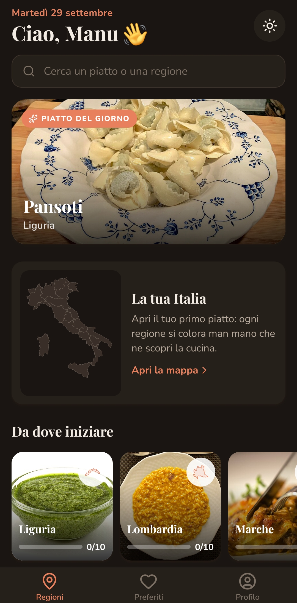
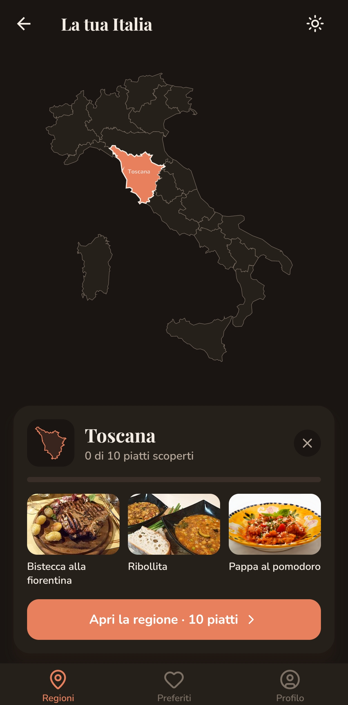
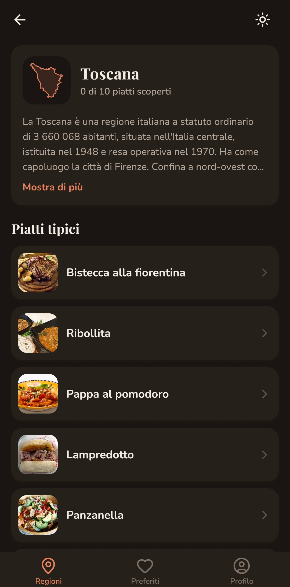
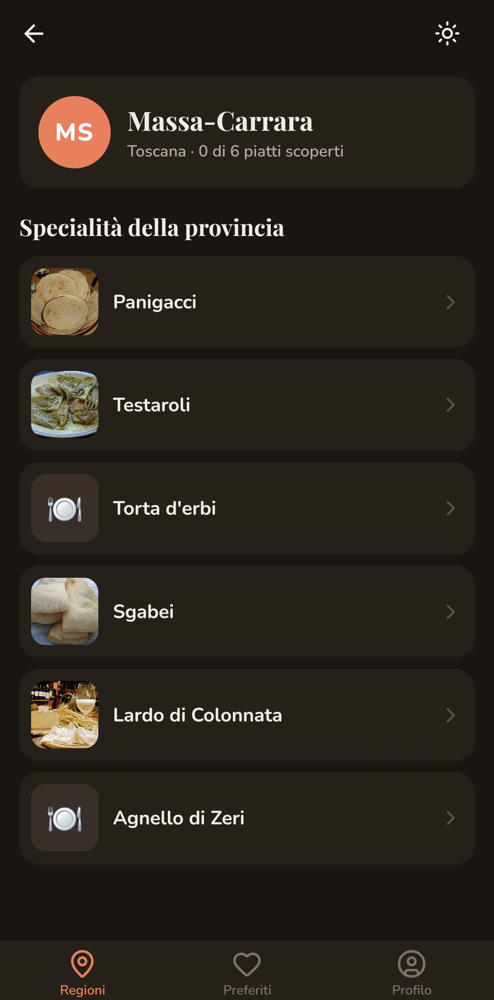
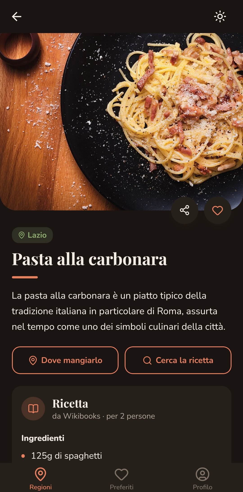
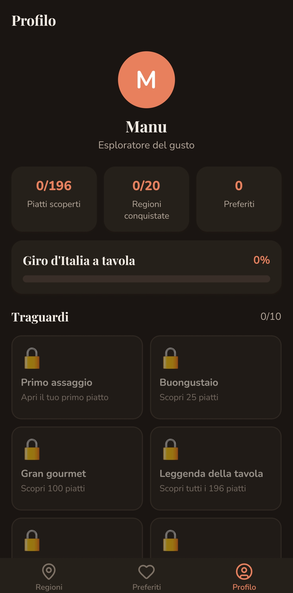

# Forklore 🍴

**Forklore** è un'app mobile in React Native per scoprire la cucina tipica italiana, regione per regione. Per ogni piatto mostra descrizione e foto prese in tempo reale da Wikipedia e, quando esiste, la ricetta dal *Libro di cucina* di Wikibooks. Si può esplorare dalla home o da una mappa interattiva dell'Italia che si colora man mano che si scoprono i piatti: una regione è "conquistata" quando hai aperto tutti i suoi piatti tipici.

L'app include ricerca, preferiti, profilo con statistiche e traguardi, tema chiaro/scuro, link per trovare un ristorante o altre ricette e un prototipo di approfondimento per provincia (Toscana).

## Screenshot

| Home | Mappa | Regione |
|:---:|:---:|:---:|
|  |  |  |

| Provincia | Dettaglio piatto | Profilo |
|:---:|:---:|:---:|
|  |  |  |

## Funzionalità

- **Login simulato**: al primo avvio basta inserire un nome, senza password. Il nome resta salvato sul telefono.
- **Home**:
  - saluto con la data del giorno e ricerca;
  - **piatto del giorno**, che cambia ogni giorno;
  - card **"La tua Italia"** con l'anteprima della mappa e i progressi;
  - carosello "Continua a esplorare", oppure "Da dove iniziare" per chi è all'inizio;
  - griglia delle 20 regioni, ognuna con la foto di un piatto tipico, la sagoma della regione e la barra di progresso.
- **Mappa interattiva** dell'Italia in SVG, con i progressi in alto: le regioni si colorano in base ai piatti scoperti. Toccando una regione compare un'anteprima con tre piatti tipici e il pulsante per aprirla. Si può ingrandire con due dita.
- **Regioni**: 10 piatti tipici scelti a mano per ciascuna, con introduzione da Wikipedia. In più, la sezione **"Altri piatti della regione"**, caricata dal vivo dalla categoria Wikipedia della regione (es. *Cucina toscana*) e ripulita da vini, oli e voci non pertinenti.
- **Province (prototipo, solo Toscana)**: le 10 province toscane con le loro specialità locali (es. Massa-Carrara: panigacci, testaroli, torta d'erbi…).
- **Dettaglio del piatto**:
  - foto a tutta larghezza, ingrandibile, e descrizione da Wikipedia;
  - **ricetta** con ingredienti e preparazione dal Libro di cucina di Wikibooks, per i piatti che ce l'hanno;
  - pulsante **"Dove mangiarlo"**: apre Google Maps con i ristoranti vicini che propongono il piatto;
  - pulsante **"Cerca la ricetta"**: apre le ricette di GialloZafferano per quel piatto;
  - preferiti, condivisione e altri piatti della stessa regione.
- **Ricerca** per nome del piatto o della regione, senza badare a maiuscole e accenti ("baba" trova "Babà").
- **Profilo**:
  - piatti scoperti, regioni conquistate e barra di avanzamento;
  - 10 **traguardi** da sbloccare;
  - tema **chiaro / scuro / di sistema**;
  - pulsante **"Azzera progressi"** (con conferma) e uscita.
- Preferiti, progressi, nome e tema sono salvati sul telefono e restano anche chiudendo l'app o senza connessione.

## Stack tecnico

- **React Native** 0.87 + **TypeScript**
- **React Navigation** 7: native stack e bottom tabs
- **TanStack Query**: chiamate a Wikipedia e Wikibooks con cache, caricamento ed errori
- **React Native MMKV**: salvataggio locale di preferiti, progressi, nome e tema
- **React Native SVG**: mappa d'Italia, sagome delle regioni e sfumature sulle foto
- **Lucide** (`lucide-react-native`): icone
- **Font personalizzati**: Playfair Display (titoli) e Nunito (testo), licenza SIL Open Font License
- **Wikipedia** (it.wikipedia.org) e **Wikibooks** (it.wikibooks.org): fonti dei contenuti, licenza CC BY-SA, nessuna chiave API
- **Confini regionali ISTAT** (via [geojson-italy](https://github.com/guglielmo/geojson-italy), licenza CC-BY): tracciati della mappa, semplificati e convertiti in SVG

## Come avviare il progetto

L'app è stata sviluppata e provata su **Android**.

### Prerequisiti

- [Node.js](https://nodejs.org/) **22.11 o successivo**
- **JDK 17**
- **Android Studio** con Android SDK installato
- Uno smartphone Android con **debug USB attivo**, oppure un emulatore Android avviato da Android Studio
- *(Windows, consigliato)* [Chocolatey](https://chocolatey.org/install#individual), utile per installare più velocemente gli strumenti necessari

Se è la prima volta che configuri l'ambiente, segui la guida ufficiale ["Set up your environment"](https://reactnative.dev/docs/set-up-your-environment) di React Native (piattaforma **Android**).

### Installazione

```bash
git clone https://github.com/Barbagallo2296/Forklore.git
cd Forklore
npm install
```

### Avvio (versione di sviluppo)

Servono **due terminali** aperti nella cartella del progetto.

**Terminale 1: avvia il bundler Metro**
```bash
npm start
```

**Terminale 2: compila e installa l'app** (con il telefono collegato via USB o l'emulatore già avviato)
```bash
npx react-native run-android
```

In questa modalità l'app legge il codice da Metro: il PC deve restare acceso e collegato.

### Installare l'app sul telefono (versione release)

Per avere un'app che funziona **senza il PC**, con il codice JavaScript incluso:

```bash
cd android
./gradlew assembleRelease        # su Windows: .\gradlew.bat assembleRelease
adb install -r app/build/outputs/apk/release/app-release.apk
```

L'APK è firmato con la chiave di debug del template: va bene per installarlo a mano, per pubblicarlo su uno store serve una chiave propria ([guida](https://reactnative.dev/docs/signed-apk-android)). Per tornare a sviluppare basta rilanciare `npx react-native run-android`.

### Dati da inserire

**Nessuno.** Non servono chiavi API né account: l'app usa gli endpoint pubblici di Wikipedia e Wikibooks. Al primo avvio chiede solo un nome (qualsiasi) per il login simulato. Per ripartire da zero con i progressi c'è **Profilo → Azzera progressi**; per cambiare nome, **Profilo → Esci**.

Serve una connessione a internet per caricare testi, foto e ricette. Preferiti e progressi funzionano anche offline.

### Test e controlli

```bash
npm test          # test con Jest (login, ricerca, progressi, filtro dei piatti, lettura delle ricette)
npm run lint      # ESLint
npx tsc --noEmit  # controllo dei tipi TypeScript
```

I moduli nativi (MMKV, safe area) e le icone vengono simulati in [`jest.setup.js`](jest.setup.js).

## Dati dei piatti

### Verifica dei piatti

Lo script [`verifica-piatti.js`](verifica-piatti.js) controlla che ogni piatto di regioni e province corrisponda a una pagina Wikipedia esistente e che non sia una **pagina di disambiguazione** (es. "Schiacciata" invece di "Schiacciata (gastronomia)"). Chiama l'API reale per tutti i piatti e segnala quelli da correggere.

```bash
node verifica-piatti.js
```

Se il titolo esatto contiene una precisazione tra parentesi, come "Jota (gastronomia)", l'app mostra solo "Jota".

### Modificare o aggiungere piatti di una regione

1. Apri [`src/data/regioni-data.json`](src/data/regioni-data.json) e modifica o aggiungi il nome del piatto nella regione desiderata. Il nome deve corrispondere **esattamente** al titolo della pagina Wikipedia in italiano, spazi e maiuscole compresi.
2. Lancia `node verifica-piatti.js`.
3. Se il piatto risulta `❌ FALLITO`, cerca il titolo esatto su [it.wikipedia.org](https://it.wikipedia.org) e correggilo.
4. Non serve modificare altro: app e script leggono lo stesso file.

Ogni regione ha anche:
- un campo `categoria` (es. `"Cucina toscana"`): la categoria di Wikipedia da cui vengono caricati gli "Altri piatti della regione";
- il **primo piatto** dell'elenco, la cui foto fa da copertina alla card della regione in home.

### Aggiungere le province di una regione

Le province sono in [`src/data/province-data.json`](src/data/province-data.json), raggruppate per `id` della regione:

```json
{
  "toscana": [
    { "id": "massa-carrara", "nome": "Massa-Carrara", "sigla": "MS", "piatti": ["Panigacci", "Testaroli"] }
  ]
}
```

Basta aggiungere una chiave con l'`id` di un'altra regione (come in `regioni-data.json`): la sezione "Per provincia" compare in automatico. Anche questi piatti vengono controllati da `verifica-piatti.js`.

I piatti di provincia e gli "altri piatti" da Wikipedia **non contano** per regioni conquistate e traguardi, che si basano solo sui 10 piatti tipici di ogni regione.

### Ricette

Le ricette vengono cercate su Wikibooks alla pagina `Libro di cucina/Ricette/<nome del piatto>` e lette in [`ricette.ts`](src/data/ricette.ts), che estrae porzioni, ingredienti (elenco puntato) e passaggi della preparazione. Oggi la ricetta c'è per circa 35 piatti tipici; per gli altri resta il pulsante "Cerca la ricetta".

## Font personalizzati

I font (Playfair Display e Nunito) sono in [`assets/fonts/`](assets/fonts/) e sono già collegati al progetto Android: dopo il clone non serve fare nulla. Se li cambi, lancia `npx react-native-asset` e rifai la build con `npx react-native run-android`: i font sono file nativi e ricaricare Metro non basta.

## Risoluzione problemi

- **L'app carica una versione vecchia o dà errori su import che sembrano corretti**: riavvia Metro svuotando la cache con `npx react-native start --reset-cache`.
- **I titoli non sono in font serif**: l'app installata è stata compilata prima dell'aggiunta dei font. Rifai la build con `npx react-native run-android`.
- **Le modifiche al codice non compaiono sul telefono**: probabilmente è installata la versione release. Reinstalla quella di sviluppo con `npx react-native run-android`.
- **Il telefono non viene rilevato**: controlla con `adb devices` che compaia come `device`. Se è `unauthorized`, accetta l'autorizzazione al debug USB sul telefono.
- **L'installazione resta ferma** (soprattutto sui Samsung): sblocca il telefono e accetta la richiesta di installazione tramite USB o di Play Protect.

## Struttura del progetto

```
App.tsx                         provider (safe area, TanStack Query, tema, utente) e navigazione
src/
  screens/                      schermate
    LoginScreen.tsx               login simulato (solo nome)
    RegioniScreen.tsx             home: saluto, ricerca, piatto del giorno, mappa, carosello, griglia
    MappaItaliaScreen.tsx         mappa interattiva (SVG, zoom, anteprima della regione)
    PiattiRegioneScreen.tsx       regione: piatti tipici, province, altri piatti da Wikipedia
    ProvinciaScreen.tsx           specialità di una provincia
    DettaglioPiattoScreen.tsx     dettaglio del piatto: Wikipedia, ricetta, link esterni
    PreferitiScreen.tsx           piatti preferiti
    ProfiloScreen.tsx             statistiche, traguardi, tema, reset, uscita
  components/                   componenti riutilizzabili
    CardRegione.tsx               card di una regione con foto, sagoma e progresso
    AnteprimaRegione.tsx          scheda che sale dal basso sulla mappa
    RicettaCard.tsx               ricetta da Wikibooks
    AzioniPiatto.tsx              pulsanti "Dove mangiarlo" e "Cerca la ricetta"
    …                             AnteprimaMappa, BottoneTema, Card, CardProvincia, ComparsaAnimata,
                                  ImmagineDissolvenza, InfoRegione, PiattoDelGiorno, RigaPiatto,
                                  SagomaRegione, Sfumatura, Skeleton, StatoVuoto
  navigation/AppNavigator.tsx   stack e tab di React Navigation
  data/
    regioni-data.json             regioni, categorie Wikipedia e 10 piatti tipici per regione
    province-data.json            province e specialità locali (per ora Toscana)
    regioni.ts                    tipi e funzioni sui dati (ricerca, piatto del giorno, province)
    wikipedia.ts                  chiamate a Wikipedia e filtro degli "altri piatti"
    ricette.ts                    chiamate a Wikibooks e lettura delle ricette
    visti.ts                      piatti scoperti e progresso per regione
    preferiti.ts                  preferiti salvati con MMKV
    traguardi.ts                  regole dei traguardi del profilo
    mappaItaliaPaths.ts           tracciati SVG delle 20 regioni
    mappaEtichette.ts             posizione dei nomi delle regioni sulla mappa
  theme/                        palette chiara/scura, font e ThemeContext
  utente/UtenteContext.tsx      Context del login simulato
assets/fonts/                   font Playfair Display e Nunito
docs/screenshots/               screenshot usati in questo README
verifica-piatti.js              verifica dei piatti su Wikipedia
__tests__/                      test Jest
jest.setup.js                   simulazione dei moduli nativi per i test
react-native.config.js          collegamento dei font al progetto nativo
```

## Sviluppi futuri

- **Ristoranti consigliati dentro l'app**, usando la posizione del telefono e un servizio di luoghi (oggi il pulsante "Dove mangiarlo" rimanda a Google Maps)
- **Ricette per tutti i piatti**, anche aggiungendole al Libro di cucina di Wikibooks
- **Province in tutte le regioni**, con una mappa delle province (i confini ISTAT sono disponibili nello stesso progetto geojson-italy)
- Filtro più preciso degli "altri piatti" (ad esempio con i dati strutturati di Wikidata)
- Test e rifinitura su **iOS**
- Login reale con sincronizzazione dei progressi tra dispositivi
- Modalità offline completa, con testi e foto già visitati salvati sul telefono

## Riferimenti utili

- [Documentazione React Native](https://reactnative.dev/docs/getting-started)
- [React Navigation](https://reactnavigation.org/)
- [TanStack Query](https://tanstack.com/query/latest)
- [React Native MMKV](https://github.com/mrousavy/react-native-mmkv)
- [React Native SVG](https://github.com/software-mansion/react-native-svg)
- [Lucide Icons per React Native](https://lucide.dev/guide/react-native/)
- [Wikipedia REST API](https://en.wikipedia.org/api/rest_v1/)
- [MediaWiki API: categorymembers](https://www.mediawiki.org/wiki/API:Categorymembers) e [parse](https://www.mediawiki.org/wiki/API:Parsing_wikitext)
- [Wikibooks: Libro di cucina](https://it.wikibooks.org/wiki/Libro_di_cucina)
- [Wikimedia: policy sullo User-Agent](https://w.wiki/4wJS)
- [Google Maps URLs](https://developers.google.com/maps/documentation/urls/get-started): come aprire una ricerca su Maps da un link
- [geojson-italy](https://github.com/guglielmo/geojson-italy): confini ISTAT di regioni e province
- [Playfair Display](https://fonts.google.com/specimen/Playfair+Display) e [Nunito](https://fonts.google.com/specimen/Nunito) su Google Fonts (scaricati tramite [Fontsource](https://fontsource.org/))
- [react-native-asset](https://github.com/unimonkiez/react-native-asset)
- [Pubblicare un'app Android firmata](https://reactnative.dev/docs/signed-apk-android)

## Autore

Manuel Barbagallo ([GitHub](https://github.com/Barbagallo2296))
